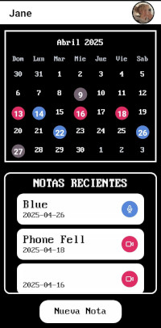

# JayNotes 

JayNotes is a simple and efficient note-taking app designed for Android. It allows you to create and manage text, audio, and video notes, and organize them by date using an integrated calendar. The app also supports multiple user profiles, so you can keep each user's notes separate and secure.

JayNotes is built with React Native and Expo and is designed to work fully offline. All data—text, audio, and video notes—are stored locally on the device.

- ### [How To Install](#Installation)
- ### [How Does It Work?](#How-It-Works)
- ### [Things To Imrpove](#Future-Improvements)
- ### [Contact Info](#Contact)

## Features

- Text, Audio, and Video Notes: Capture and store notes in various formats—text, audio, or video.

- Calendar Integration: Assign each note to a specific date and access them easily through an intuitive calendar interface.

  

- Multi-User Support: Multiple users can share the same device, each with their own notes and profiles.

- Offline Access: All data is stored locally, ensuring the app works seamlessly even without an internet connection.

- Profile Management: Secure login with password protection, along with quick access to recent user profiles by displaying profile pictures.

  

## Installation

JayNotes is available as a direct APK download for Android.

1. Go to the [Releases](#https://github.com/0JK0/JayNotes/releases) section.
2. [Download The Latest APK](https://github.com/0JK0/JayNotes/releases)
3. Transfer it to your Android device if needed.
4. Open it and follow the installation prompts.

## How It Works

Upon opening the app, users can:

 - Create a new account with a username and password.

 - Add notes in text, audio, or video format by selecting a date on the calendar.

 - Access their notes at any time, organized by date and user profile.

## Future Improvements

 - Cloud Sync: Sync notes across devices.

 - Reminders: Integrate notifications to remind users about specific notes or events.

 - Rich Text Editor: Add support for text formatting, such as bold, italics, and bullet points.

 - File Attachments: Allow users to attach images or documents to text notes.

## Tech Stack

- React Native: Framework for building cross-platform mobile apps.

- Expo: Provides tools for development and deployment of React Native apps.

- Expo Local Storage: Stores notes and user data securely on the device.

- Expo-SQLite: Manages and organizes the local database for efficient offline access.
  

## Contact
If you have any questions or suggestions do not feel free to reach out to me, Thanks <3 :
- Email: JulianOsorioProf22@gmail.com
- LinkedIn: [Julian Monsalve](https://www.linkedin.com/in/julian-monsalve-69420-osorio/)
- GitHub: [0JK0](https://github.com/0JK0)

                            ╱|、
                          (˚ˎ 。7  
                           |、˜〵          
                          じしˍ,)ノ

